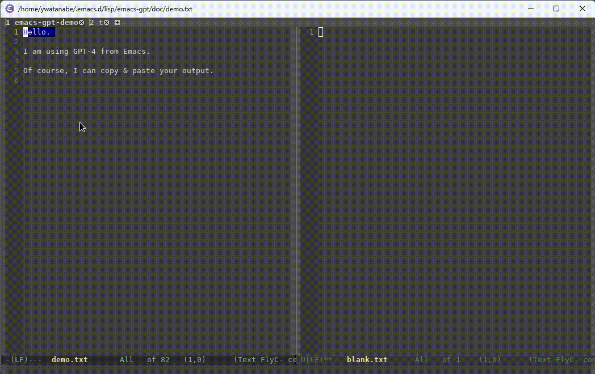

# Installation
```
EMACS_GPT_DIR=~/.emacs.d/lisp/emacs-gpt/
$ git clone git@github.com:ywatanabe1989/emacs-gpt.git $EMACS_GPT_DIR
```

# Demo


# Python installation

``` elisp
cd $EMACS_GPT_DIR
python -m venv env && source env/bin/activate && pip install -U pip && pip install -r requirements.txt
```

# Emacs config
``` elisp
(add-to-list 'load-path getenv("EMACS_GPT_DIR"))
(require 'emacs-gpt)
(setq gpt-openai-key getenv("OPENAI_API_KEY"))
(setq gpt-python-path getenv("OPENAI_API_KEY"))
(setq gpt-openai-engine "gpt-4o") ; gpt-4, gpt-3.5-turbo, etc
(setq gpt-script-path (concat getenv("EMACS_GPT_DIR") emacs-gpt.py))

(define-key global-map (kbd "M-C-g") 'gpt-on-region)
```


<!-- (add-to-list 'load-path "~/.emacs.d/lisp/emacs-gpt") -->
<!-- (setq gpt-script-path "~/.emacs.d/lisp/emacs-gpt/emacs-gpt.py") -->
<!-- (setq gpt-openai-max-tokens "2000")
 !-- (setq gpt-openai-temperature "0") -->
<!-- (define-key global-map (kbd "M-S-C-g") 'gpt-clear-history) -->
